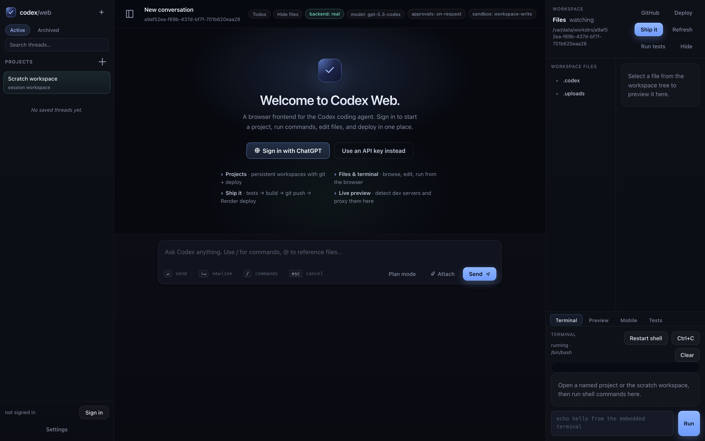
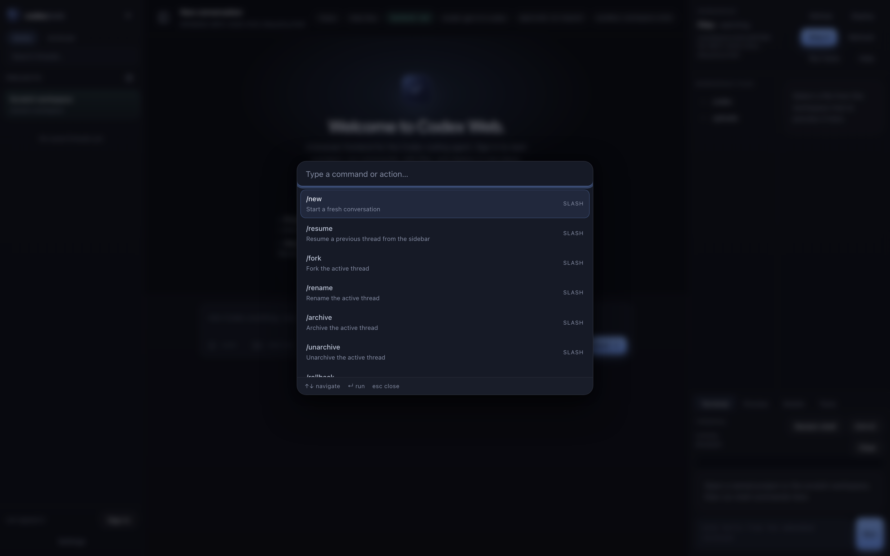
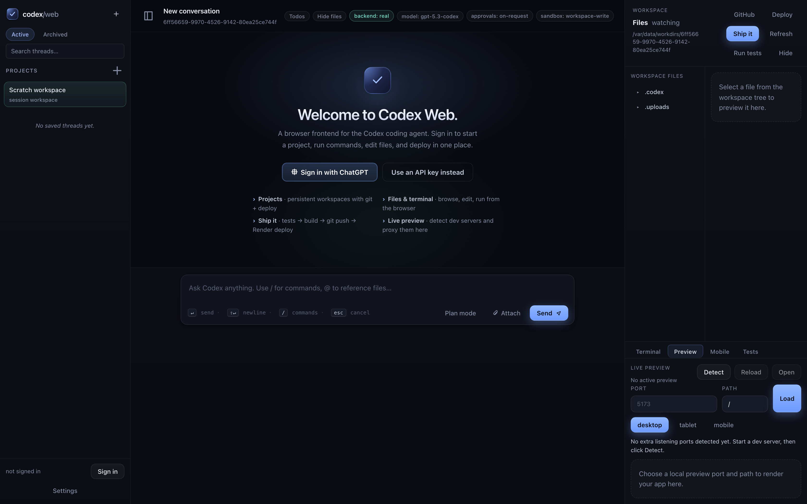
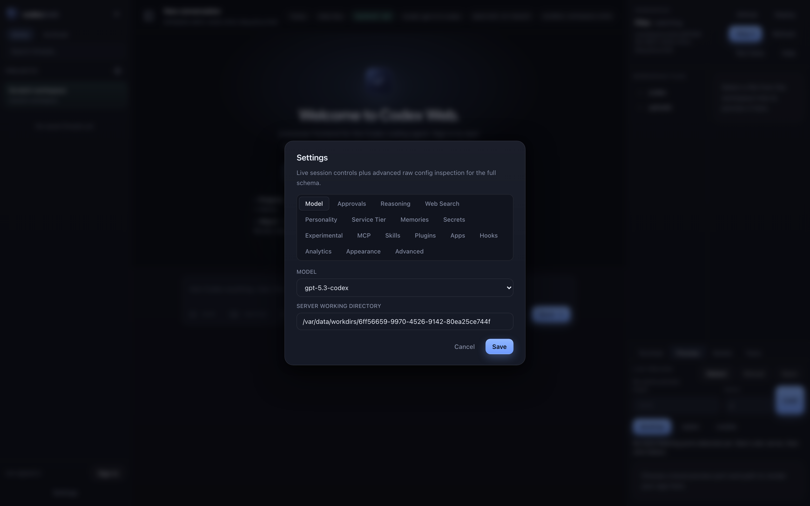
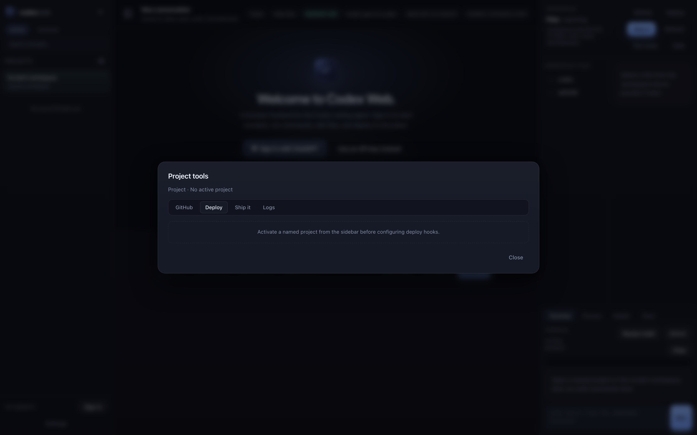

# Codex Web

A production-grade browser UI for the Rust `codex app-server` -- chat, diffs,
files, terminal, preview, and one-click deploys, all in one tab.

**Live:** [codex-web-zkqj.onrender.com](https://codex-web-zkqj.onrender.com)

<p align="center">
  
</p>

---

## Table of contents

- [What you get](#what-you-get)
- [Screenshots](#screenshots)
- [Quick start](#quick-start)
- [Deploy](#deploy)
- [Authentication](#authentication)
- [Testing](#testing)
- [Architecture](#architecture)
- [Repository layout](#repository-layout)
- [Docs](#docs)
- [License](#license)

---

## What you get

A browser frontend for the Codex coding agent that mirrors the native TUI
experience and adds a full project workspace around it.

### Chat & agent loop

- Real `codex app-server` v2 transport over HTTP + WebSocket -- no mock mode
- Streaming agent output with collapsible reasoning blocks and effort badges
- Rich per-file diff cards with add/remove counts and per-file approvals
- Exec approval cards with once / session / deny decisions
- Approval requests stream live, with keyboard-friendly confirm/deny
- Edit-and-resend or fork-from-here on any prior user message

### Composer & productivity

- `Cmd+K` command palette: fuzzy-search every slash command in one keystroke
- `/` slash-command autocomplete with inline descriptions and keybind hints
- `@` file-reference autocomplete backed by server-side fuzzy search
- Drag-and-drop attachments, paste-from-clipboard, rich image thumbnails
- Plan mode toggle for read-only planning turns before tools unlock
- Keyboard shortcuts: sidebar toggle, new thread, settings, slash focus,
  jump-to-latest, and a full reference modal

### Threads & projects

- Projects sidebar with a persistent scratch workspace and named projects
- Thread list with search, pinning, archive/unarchive, rename, duplicate,
  export-as-JSON, and right-click context menu
- Thread resume / fork / rollback flows backed by real app-server RPCs
- Shared thread replay links -- send a read-only URL, recipient sees the
  timeline without a composer
- Rewind and re-run any turn with edited context

### Workspace panes

- File tree with live `FsWatch` updates and in-browser file preview
- Embedded terminal (xterm.js + node-pty) sharing the session workdir
- Live preview pane that detects dev-server ports and proxies them
  through signed URLs
- Mobile preview via Expo tunnel QR code
- Test runner that auto-detects `package.json` / `Cargo.toml` / `pytest.ini`
  and streams pass/fail summaries into the UI
- Database browser for SQLite files in the workdir

### Ship it

- GitHub OAuth sign-in, repo picker, clone / commit / push / PR
- One-click deploys: Render, Vercel, Netlify, Cloudflare Pages
- Ship-it pipeline: tests -> build -> deploy -> git tag -> changelog
- Render log-tail panel inside project tools
- Monitoring panel stubs for Sentry / PostHog one-click inject

### Settings & platform

- Settings modal with tabs for model, approvals, reasoning, web search,
  memories, secrets, experimental flags, and **full config** raw editor
- MCP server manager with live status, OAuth login, refresh controls
- Skills / plugins / apps managers backed by real RPCs
- Per-project secrets vault, encrypted at rest, injected on agent spawn
- Hooks editor for `PreToolUse` / `PostToolUse` / `UserPromptSubmit`
  / `SessionStart` / `Stop`
- Memory browser for discovered `AGENTS.md` / `CLAUDE.md` with reset
  and thread-memory-mode controls
- Sub-agent task tray: spawn, monitor, and cancel parallel agent runs
- Toast notifications, theme awareness, collapsible sidebar that
  remembers its state

---

## Screenshots

### Signed-out welcome

<p align="center">
  
</p>

### Command palette (Cmd+K)

<p align="center">
  
</p>

### Workspace -- terminal tab

<p align="center">
  
</p>

### Workspace -- live preview

<p align="center">
  
</p>

### Settings

<p align="center">
  
</p>

### Project tools (GitHub / Deploy / Logs)

<p align="center">
  
</p>

---

## Quick start

### 1. Use an installed Codex binary

```bash
cd web
npm install
CODEX_BIN="$HOME/.local/bin/codex" npm start
```

### 2. Build the standalone backend first

```bash
./web/scripts/build-codex-bin.sh
cd web
CODEX_BIN="$HOME/codex-bin/codex-app-server" npm start
```

Open http://127.0.0.1:5000 and sign in with ChatGPT (browser callback) or
an API key. Localhost automatically uses the browser-callback flow.

---

## Deploy

### Render (recommended public host)

Render is first-class: inbound WebSockets, Docker deploys, persistent disks.

This repo ships:

- [`render.yaml`](./render.yaml) -- Blueprint
- [`web/Dockerfile.render`](./web/Dockerfile.render) -- production image
- `GET /healthz` -- zero-downtime health endpoint
- 5 GB persistent disk mounted at `/var/data` for session workdirs + uploads
- Generated `CODEX_WEB_FILE_SIGNING_SECRET` for signed preview URLs

Launch flow:

1. Push to GitHub.
2. Render -> New Blueprint -> point at this repo.
3. Accept the checked-in `render.yaml`.
4. Wait for the Docker build (first Rust build: ~45 min).
5. Open the generated `*.onrender.com` URL.

Public deployments use the ChatGPT **device-code** flow automatically.

### Replit

Replit runs against a pre-built standalone backend:

```bash
./web/scripts/build-codex-bin.sh
cd web
CODEX_BIN="$HOME/codex-bin/codex-app-server" npm start
```

The checked-in [`.replit`](./.replit) points both the workspace run
command and Deployments build/run flow at the standalone backend.

### Docker

```bash
docker build -f web/Dockerfile.render -t codex-web .
docker run --rm -p 5000:5000 -v codex-web-data:/var/data codex-web
```

---

## Authentication

Three sign-in paths, picked automatically by origin:

| Origin | Flow |
|---|---|
| `localhost` / `127.0.0.1` | Browser-callback OAuth (`account/login/start { type: "chatgpt" }`) |
| Any public origin | Gateway-managed device-code OAuth |
| Automation | `POST /api/login` with an `OPENAI_API_KEY` |

The gateway owns refresh-token handling for device-code sessions, so
long-running browser sessions stay signed in without re-auth.

GitHub sign-in is separate (standard authorization-code grant) and powers
the repo picker, clone, commit, push, and PR flows.

---

## Testing

Smoke suites run against a real backend -- there is no mock mode.

```bash
cd web

# Unauthenticated smoke (boot, WebSocket handshake, static routes)
CODEX_BIN="$HOME/.local/bin/codex" npm run test:e2e

# Auth-gated smoke (device-code path skipped)
CODEX_BIN="$HOME/.local/bin/codex" PLAYWRIGHT_AUTH=1 \
  npm run test:e2e:auth

# Authenticated workflow smoke with a real API key
CODEX_BIN="$HOME/.local/bin/codex" \
  PLAYWRIGHT_AUTH=1 \
  PLAYWRIGHT_API_KEY="$OPENAI_API_KEY" \
  npm run test:e2e:auth
```

---

## Architecture

```
Browser
  |-- Vanilla-JS frontend (web/public)
  |     |-- WebSocket -> /ws  (JSON-RPC 2.0)
  |     `-- HTTP      -> /api/*  (session, auth, uploads, workdir files)
  |
  `-- Node Express gateway (web/server.mjs)
        |-- Owns session cookies + per-session workdirs
        |-- Manages ChatGPT device-code + GitHub OAuth flows
        |-- Signs workdir file URLs via HMAC
        `-- Spawns and proxies to ->
              |
              `-- Rust codex-app-server (codex-rs/app-server)
                    |-- Pure JSON-RPC 2.0
                    |-- MCP, hooks, skills, plugins, memory
                    `-- Sandboxed tool runtime
```

The gateway is a **transparent JSON-RPC proxy** -- it does not decode or
rewrite agent traffic. Every message on the wire is a canonical
app-server-protocol frame. The gateway only layers in session bookkeeping,
auth, uploads, and signed workdir file serving.

---

## Repository layout

| Path | Purpose |
|---|---|
| [`web/`](./web/) | Browser client, Node gateway, Playwright suites, Replit helpers |
| [`web/public/`](./web/public/) | Vanilla-JS frontend (no build step) |
| [`web/server.mjs`](./web/server.mjs) | JSON-RPC gateway, session manager, OAuth |
| [`codex-rs/`](./codex-rs/) | Rust `app-server`, protocol, hooks, skills, MCP |
| [`codex-rs/app-server/`](./codex-rs/app-server/) | The backend binary |
| [`codex-rs/protocol/`](./codex-rs/protocol/) | v2 protocol types |
| [`docs/`](./docs/) | Broader repository and contributor docs |
| [`render.yaml`](./render.yaml) | Render Blueprint |
| [`.replit`](./.replit) | Replit workspace + Deployments config |

---

## Docs

- [Web app guide](./web/README.md)
- [Release checklist](./web/RELEASE_CHECKLIST.md)
- [Render deployment notes](./web/README.md#render)
- [Replit deployment notes](./replit.md)
- [Contributing](./docs/contributing.md)

---

## License

This repository is licensed under the [Apache-2.0 License](./LICENSE).
